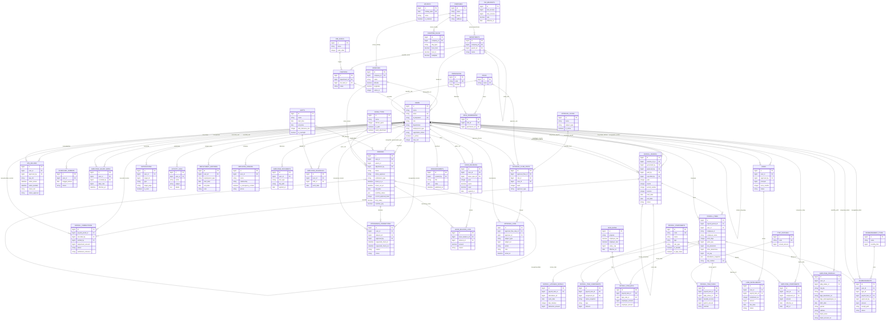

# ERD Lengkap: Absensi, Payroll & Modul Talenta

Satu diagram utuh (tabel lama + tabel baru). Geser/scroll untuk melihat semuanya.

Zoom: 3200px

```mermaid
erDiagram
    USERS {
        bigint id PK
        string name
        string email UK
        string id_karyawan UK
        string role
        string departemen
        string employment_type
        string registration_status
        boolean is_active
        integer sisa_cuti
    }
    ABSENSIS {
        bigint id PK
        bigint user_id FK
        bigint parent_id FK
        bigint adjustment_by FK
        string status
        string status_approval
        string submission_type
        datetime check_in_at
        datetime check_out_at
        date end_date
        json workflow_status
        integer current_approval_level
        decimal final_salary
        decimal overtime_pay
    }
    IZIN_KELUARS {
        bigint id PK
        bigint user_id FK
        bigint approved_by FK
        string tipe_izin
        datetime waktu_keluar
        datetime waktu_kembali
        string status_izin
        string status_approval
    }
    SCHEDULED_LEMBURS {
        bigint id PK
        bigint user_id FK
        date tanggal_lembur
        string status
    }
    EMPLOYEE_SALARY_RATES {
        bigint id PK
        bigint user_id FK
        bigint recorded_by FK
        bigint daily_rate
        datetime effective_at
    }
    PAYROLL_PERIODS {
        bigint id PK
        bigint revision_of_id FK
        bigint generated_by FK
        bigint approved_by FK
        bigint paid_by FK
        bigint cancelled_by FK
        integer year
        integer month
        integer period_number
        integer revision
        date start_date
        date end_date
        string status
    }
    PAYROLL_ITEMS {
        bigint id PK
        bigint payroll_period_id FK
        bigint user_id FK
        string employee_id
        string employee_name
        integer work_days
        bigint gross_pay
        bigint late_deduction
        bigint other_deductions
        bigint net_pay
        json attendance_snapshot
        string slip_number UK
    }
    PAYROLL_LATENESS_DETAILS {
        bigint id PK
        bigint payroll_item_id FK
        bigint attendance_id
        date work_date
        integer late_minutes
        bigint deduction_amount
    }
    PAYROLL_CORRECTIONS {
        bigint id PK
        bigint payroll_period_id FK
        bigint recorded_by FK
        bigint settled_by FK
        bigint adjustment_amount
        string status
        string settlement_reference
    }
    NOTIFICATIONS {
        bigint id PK
        bigint user_id FK
        bigint target_id
        string type
        string target_page
        boolean is_read
    }
    ACTIVITY_LOGS {
        bigint id PK
        bigint user_id FK
        string action
        string subject
        text details
    }
    HOLIDAYS {
        bigint id PK
        date holiday_date UK
        string name
        boolean is_national
    }
    COMPANIES {
        bigint id PK
        string name
        string npwp
        string address
    }
    BRANCHES {
        bigint id PK
        bigint company_id FK
        string name
        decimal latitude
        decimal longitude
        integer radius_m
    }
    DEPARTMENTS {
        bigint id PK
        bigint company_id FK
        bigint parent_id FK
        string name
    }
    JOB_LEVELS {
        bigint id PK
        string name
        integer rank_order
    }
    POSITIONS {
        bigint id PK
        bigint department_id FK
        bigint job_level_id FK
        string name
    }
    EMPLOYEE_PROFILES {
        bigint id PK
        bigint user_id FK
        bigint ptkp_status_id FK
        string nik_ktp
        string npwp
        string bpjs_kesehatan_no
        string bpjs_ketenagakerjaan_no
        date birth_date
        string gender
        string address
        string bank_name
        string bank_account_no
    }
    EMPLOYMENT_HISTORIES {
        bigint id PK
        bigint user_id FK
        string employment_type
        date start_date
        date end_date
        string note
    }
    EMPLOYEE_FAMILIES {
        bigint id PK
        bigint user_id FK
        string name
        string relationship
        boolean is_emergency_contact
        string phone
    }
    EMPLOYEE_DOCUMENTS {
        bigint id PK
        bigint user_id FK
        string doc_type
        string file_path
        date expired_at
    }
    SHIFTS {
        bigint id PK
        string name
        time start_time
        time end_time
        integer late_tolerance_min
        boolean is_overnight
    }
    EMPLOYEE_SCHEDULES {
        bigint id PK
        bigint user_id FK
        bigint shift_id FK
        date work_date
    }
    ATTENDANCE_CORRECTIONS {
        bigint id PK
        bigint user_id FK
        bigint absensi_id FK
        bigint approved_by FK
        datetime requested_check_in
        datetime requested_check_out
        string reason
        string status
    }
    LEAVE_TYPES {
        bigint id PK
        string name
        integer default_quota
        boolean is_paid
        boolean need_attachment
    }
    LEAVE_BALANCES {
        bigint id PK
        bigint user_id FK
        bigint leave_type_id FK
        integer year
        decimal quota
        decimal used
        date expired_at
    }
    LEAVE_BALANCE_LOGS {
        bigint id PK
        bigint leave_balance_id FK
        bigint absensi_id FK
        decimal amount
        string reason
    }
    APPROVAL_FLOWS {
        bigint id PK
        string name
        string subject_type
        boolean is_active
    }
    APPROVAL_FLOW_STEPS {
        bigint id PK
        bigint approval_flow_id FK
        bigint role_id FK
        bigint user_id FK
        integer level
        string approver_type
    }
    APPROVAL_LOGS {
        bigint id PK
        bigint approval_flow_step_id FK
        bigint approver_id FK
        string subject_type
        bigint subject_id
        string action
        string note
        datetime acted_at
    }
    ROLES {
        bigint id PK
        string name UK
    }
    PERMISSIONS {
        bigint id PK
        string code UK
        string module
    }
    ROLE_PERMISSIONS {
        bigint id PK
        bigint role_id FK
        bigint permission_id FK
    }
    OVERTIME_RULES {
        bigint id PK
        bigint company_id FK
        string day_type
        decimal hour_from
        decimal hour_to
        decimal multiplier
    }
    PAYROLL_COMPONENTS {
        bigint id PK
        string code UK
        string name
        string type
        string calc_type
        boolean is_taxable
        boolean is_bpjs_base
    }
    EMPLOYEE_COMPONENTS {
        bigint id PK
        bigint user_id FK
        bigint component_id FK
        bigint amount
        date effective_at
        date end_at
    }
    PAYROLL_ITEM_COMPONENTS {
        bigint id PK
        bigint payroll_item_id FK
        bigint component_id FK
        string name_snapshot
        string type
        bigint amount
    }
    BPJS_RATES {
        bigint id PK
        string program
        decimal employee_rate
        decimal employer_rate
        bigint salary_cap
        date effective_at
    }
    PAYROLL_ITEM_BPJS {
        bigint id PK
        bigint payroll_item_id FK
        bigint bpjs_rate_id FK
        bigint employee_amount
        bigint employer_amount
    }
    PTKP_STATUSES {
        bigint id PK
        string code UK
        bigint annual_amount
    }
    TAX_BRACKETS {
        bigint id PK
        bigint min_income
        bigint max_income
        decimal rate
        date effective_at
    }
    PAYROLL_ITEM_TAXES {
        bigint id PK
        bigint payroll_item_id FK
        bigint ptkp_status_id FK
        bigint taxable_income
        bigint pph21_amount
        string method
    }
    LOANS {
        bigint id PK
        bigint user_id FK
        bigint approved_by FK
        bigint principal
        integer tenor_months
        string status
    }
    LOAN_INSTALLMENTS {
        bigint id PK
        bigint loan_id FK
        bigint payroll_item_id FK
        integer installment_no
        bigint amount
        date due_date
        string status
    }
    REIMBURSEMENT_TYPES {
        bigint id PK
        string name
        bigint monthly_limit
    }
    REIMBURSEMENTS {
        bigint id PK
        bigint user_id FK
        bigint type_id FK
        bigint payroll_item_id FK
        bigint approved_by FK
        bigint amount
        string receipt_path
        string status
    }
    ANNOUNCEMENTS {
        bigint id PK
        bigint created_by FK
        string title
        text body
        datetime published_at
    }

    USERS ||--o{ ABSENSIS : membuat
    ABSENSIS o|--o{ ABSENSIS : mengelompokkan
    USERS o|--o{ ABSENSIS : mengubah_penyesuaian_gaji
    USERS ||--o{ IZIN_KELUARS : mengajukan
    USERS o|--o{ IZIN_KELUARS : menyetujui
    USERS ||--o{ SCHEDULED_LEMBURS : menjadwalkan
    USERS ||--o{ EMPLOYEE_SALARY_RATES : memiliki_tarif
    USERS o|--o{ EMPLOYEE_SALARY_RATES : mencatat_tarif
    USERS o|--o{ PAYROLL_PERIODS : membuat_payroll
    USERS o|--o{ PAYROLL_PERIODS : menyetujui_payroll
    USERS o|--o{ PAYROLL_PERIODS : membayar_payroll
    USERS o|--o{ PAYROLL_PERIODS : membatalkan_payroll
    PAYROLL_PERIODS o|--o{ PAYROLL_PERIODS : revisi_dari
    PAYROLL_PERIODS ||--o{ PAYROLL_ITEMS : berisi
    USERS ||--o{ PAYROLL_ITEMS : karyawan
    PAYROLL_ITEMS ||--o{ PAYROLL_LATENESS_DETAILS : rincian_telat
    PAYROLL_PERIODS ||--o{ PAYROLL_CORRECTIONS : memiliki_koreksi
    USERS o|--o{ PAYROLL_CORRECTIONS : mencatat_koreksi
    USERS o|--o{ PAYROLL_CORRECTIONS : menyelesaikan_koreksi
    USERS ||--o{ NOTIFICATIONS : menerima
    USERS o|--o{ ACTIVITY_LOGS : melakukan

    COMPANIES ||--o{ BRANCHES : punya_cabang
    COMPANIES ||--o{ DEPARTMENTS : punya_departemen
    DEPARTMENTS o|--o{ DEPARTMENTS : induk_dari
    DEPARTMENTS ||--o{ POSITIONS : memiliki_posisi
    JOB_LEVELS ||--o{ POSITIONS : tingkat
    BRANCHES o|--o{ USERS : ditempatkan_di
    DEPARTMENTS o|--o{ USERS : berada_di
    POSITIONS o|--o{ USERS : menjabat
    USERS o|--o{ USERS : atasan_langsung
    ROLES o|--o{ USERS : memiliki_role
    USERS ||--o| EMPLOYEE_PROFILES : memiliki_profil
    PTKP_STATUSES o|--o{ EMPLOYEE_PROFILES : status_ptkp
    USERS ||--o{ EMPLOYMENT_HISTORIES : riwayat_kerja
    USERS ||--o{ EMPLOYEE_FAMILIES : keluarga
    USERS ||--o{ EMPLOYEE_DOCUMENTS : dokumen
    USERS ||--o{ EMPLOYEE_SCHEDULES : dijadwalkan
    SHIFTS ||--o{ EMPLOYEE_SCHEDULES : dipakai_di
    SHIFTS o|--o{ ABSENSIS : shift_absensi
    BRANCHES o|--o{ ABSENSIS : lokasi_absen
    USERS ||--o{ ATTENDANCE_CORRECTIONS : mengajukan_koreksi
    ABSENSIS ||--o{ ATTENDANCE_CORRECTIONS : dikoreksi
    USERS o|--o{ ATTENDANCE_CORRECTIONS : menyetujui_koreksi
    LEAVE_TYPES ||--o{ LEAVE_BALANCES : jenis
    USERS ||--o{ LEAVE_BALANCES : saldo_cuti
    LEAVE_BALANCES ||--o{ LEAVE_BALANCE_LOGS : mutasi
    ABSENSIS o|--o{ LEAVE_BALANCE_LOGS : memotong_saldo
    LEAVE_TYPES o|--o{ ABSENSIS : jenis_cuti
    APPROVAL_FLOWS ||--o{ APPROVAL_FLOW_STEPS : memiliki_level
    ROLES o|--o{ APPROVAL_FLOW_STEPS : approver_role
    USERS o|--o{ APPROVAL_FLOW_STEPS : approver_khusus
    APPROVAL_FLOW_STEPS ||--o{ APPROVAL_LOGS : riwayat
    USERS ||--o{ APPROVAL_LOGS : memutuskan
    ROLES ||--o{ ROLE_PERMISSIONS : punya
    PERMISSIONS ||--o{ ROLE_PERMISSIONS : diberikan
    COMPANIES ||--o{ OVERTIME_RULES : aturan_lembur
    USERS ||--o{ EMPLOYEE_COMPONENTS : komponen_tetap
    PAYROLL_COMPONENTS ||--o{ EMPLOYEE_COMPONENTS : dipakai
    PAYROLL_ITEMS ||--o{ PAYROLL_ITEM_COMPONENTS : rincian_komponen
    PAYROLL_COMPONENTS o|--o{ PAYROLL_ITEM_COMPONENTS : sumber
    PAYROLL_ITEMS ||--o{ PAYROLL_ITEM_BPJS : rincian_bpjs
    BPJS_RATES ||--o{ PAYROLL_ITEM_BPJS : tarif
    PAYROLL_ITEMS ||--o| PAYROLL_ITEM_TAXES : rincian_pph21
    PTKP_STATUSES ||--o{ PAYROLL_ITEM_TAXES : ptkp
    USERS ||--o{ LOANS : mengajukan_kasbon
    USERS o|--o{ LOANS : menyetujui_kasbon
    LOANS ||--o{ LOAN_INSTALLMENTS : cicilan
    PAYROLL_ITEMS o|--o{ LOAN_INSTALLMENTS : dipotong_di
    REIMBURSEMENT_TYPES ||--o{ REIMBURSEMENTS : jenis
    USERS ||--o{ REIMBURSEMENTS : mengajukan_klaim
    USERS o|--o{ REIMBURSEMENTS : menyetujui_klaim
    PAYROLL_ITEMS o|--o{ REIMBURSEMENTS : dibayar_di
    USERS ||--o{ ANNOUNCEMENTS : membuat
```